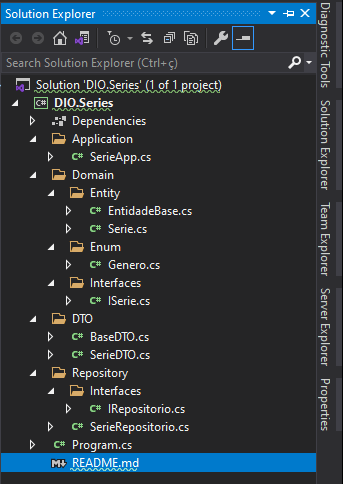

# 💻 Criando um APP simples de cadastro de séries em .NET

<h1 align="center">

</h1>

<p align="center">
    <a href="https://www.linkedin.com/in/dev-full-stack/">
        
    </a>
</p>

---

### ⚔ Desafio

Desafio feito no Bootcamp da Digital Innovation One.

O objetivo desse desavio foi criar um algoritmo simples de de cadastro de séries para praticar os conhecimentos de orientado a objetos. 

Foram usados conceitos de DDD e Clean Architecture. Para criar uma entidade composta, usando objetos de valor.

A aplicação foi separada em camadas com responsabilidades bem definidas: camada de Domínio com Interfaces, camada de Repositório e Camada de Aplicação.

---

### 📷 Screenshots



---

## 🛠️ Tecnologias Utilizadas

- C#;
- .NET 5;
- DDD;
- Clean Architecture;

## ⏬ Como baixar o projeto
- <b style="color:red"> OBS: </b> É necessário ter o git instalado em sua máquina
- Executar o Seguinte comando no seu **Terminal** ou no **CMD**:

```bash
        git clone https://github.com/armandofc1/dioserie.git
```


## ⌨️ Autor

<br>
<sub><b>Armando Costa</b></sub>

##### Contatos
[](https://www.linkedin.com/in/dev-full-stack/)

